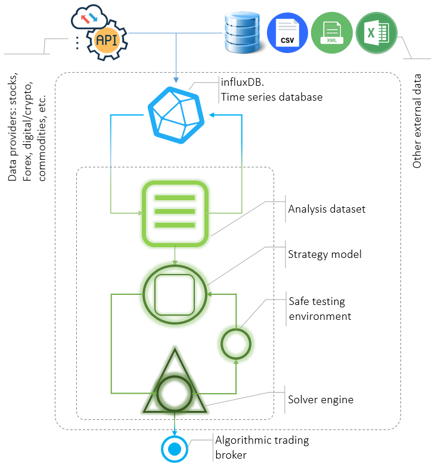

# chameleonQuant

 
<html>
<head>
 
<link rel="stylesheet" href="mystyle.css">
  
</head>
<body>

  

<h1>Mission</h1>

 The framework is meant to help quants developing and testing innovative strategies in the financial trading sector in a completely open-source environment. 

<h1>It's a jungle out there!</h1>

<h1>First step into the jungle</h1>
<h3>Your survival kit</h3>

     

<h3>Make some practice</h3>
<h3>Share with friends</h3>

<h1>Versioning and Packaging</h1>

<h1>References</h1>

</body>
</html>
