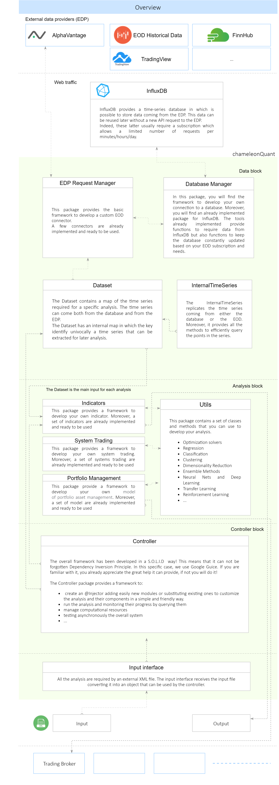

# chameleonQuant

 
<html>
<head>
  
</head>
<body>

  

<h1>Mission</h1>

 The framework is meant to help quants developing and testing innovative algorithmic trading strategies in the financial trading sector in a completely open-source environment. 

<h1>It's a jungle out there!</h1>

The financial market is a jungle. There are hidden gems waiting to be discovered but also ravenous beasts in the shadow waiting for your misstep. Experience, spirit of adaptation, and rock-solid hunting strategies are your true weapons to survive and thrive in the jungle. 
The chameleon is a master in this! It is a patient predator adapting to the surrounding environment and, when it's time to act, it is swift and deadly. Like a chameleon, you will need these skills to protect and grow your wealth in the financial market. Just like any young chameleon, you need to develop the best strategies that fit your expectations, learn from your mistakes, and keep evolving. 
The first steps are always the hardest. Do not give way to discouragement! There are probably zillions of things that are going through your mind right now, but keep reading, we will show you how chameleonQuant can help you to develop your own tool kit to live in the financial market jungle.

<h1> Prerequisites</h1>

<h1> Installing</h1>
Please note that this library is still in early development stages. Major API changes are expected in the near future.

<h1>First step into the jungle</h1>

No one would step into the jungle without a survival kit!  chameleonQuant helps you in this, providing you  a basic survival tool kit and a framework to support you in developing your own tools. A good understanding of the basic tools will help you to familiarize with the framework and its components, test a few preimplemented indicators,  strategies, etc, and unleash your creativity developing new ones. 

<h3>Your basic survival kit</h3>

 <figure align="center">
     
     <figcaption>
     
Basic survival kit scheme

     </figcaption>
  </figure>

<ul>
<li>Map - Data block</li>

An object that can not miss in a survival kit is a map. This is fundamental to navigate in the financial market. This map is not a classic map. If you use an old-school paper road map, this relies on a static environment. Even if unexpected events can always happen to delay your arrival, sooner or later you will reach your destination, which didn't change its position in the meanwhile. The financial market is poles apart. It is a very dynamic environment in which time plays a fundamental role. A static map would be useless because the financial market is in constant evolution. The financial market is composed by securities like a jungle is composed by plants. 
Just like the water and the sun are the main resources a plant needs to growth, in the classic model of an efficient security market, prices move in response to new public information that causes traders to simultaneously revise their belief ( <a href="https://papers.ssrn.com/sol3/papers.cfm?abstract_id=1298299">Why Do Security Prices Change? A Transaction-Level Analysis of Nyse Stocks</a> ). I know...I know... prices follow much more complicated models, but let me keep it simple, for now.   
A financial market map records the history of the securities and make them easily available to the user. Forecast the future evolution of the map is the ultimate goal of the user that can use its history as an input for predictive models.  

 <table style="width:100%">
  <caption style="font-weight: bold">Exchanges</caption>
  <tr>
    <th>Exchange</th>
    <th>Short name</th>
  </tr>
  <tr>
    <td>American Stock Exchange</td>
    <td>AMEX</td>
  </tr>
  <tr>
    <td>NASDAQ Stock Exchange</td>
    <td>NASDAQ</td>
  </tr>
  <tr>
    <td>New York Mercantile Exchange</td>
    <td>NYMEX</td>
  </tr>
   <tr>
    <td>Foreign exchange market</td>
    <td>FOREX</td>
  </tr>
  <tr>
    <td>...</td>
    <td>...</td>
  </tr>
 </table>
 
 <table style="width:100%">
 <caption style="font-weight: bold">NASDAQ Stock Exchange</caption>
  <tr>
    <th>Name</th>
    <th>Ticker</th>
  </tr>
  <tr>
    <td>Apple Inc.</td>
    <td>AAPL</td>
  </tr>
  <tr>
    <td>Amazon.com Inc.</td>
    <td>AMZN</td>
  </tr>
  <tr>
    <td>Facebook Inc.</td>
    <td>FB</td>
  </tr>
   <tr>
    <td>Alphabet Inc Class A</td>
    <td>GOOGL</td>
  </tr>
  <tr>
    <td>...</td>
    <td>...</td>
  </tr>
 </table>
 
 <table style="width:100%">
 <caption style="font-weight: bold">AMZN_EOD</caption>
  <tr>
    <th>Time</th>
    <th>Close</th>
    <th>High</th>
    <th>Low</th>
    <th>Open</th>
    <th>Volume</th>
  </tr>
 <tr><td>...</td> <td>...</td>   <td>...</td>   <td>...</td>   <td>...</td>   <td>...</td></tr>
 <tr><td>2020-12-09T08:00:00Z</td> <td>17.16</td>   <td>18.63</td>   <td>16.63</td>   <td>18.37</td>   <td>138508325</td></tr>
 <tr><td>2020-12-10T08:00:00Z</td> <td>17.99</td>   <td>18.04</td>   <td>16.67</td>   <td>16.75</td>   <td>86395155</td></tr>
 <tr><td>2020-12-11T08:00:00Z</td> <td>17.05</td>   <td>17.91</td>   <td>16.81</td>   <td>17.82</td>   <td>106957296</td></tr>
 <tr><td>2020-12-14T08:00:00Z</td> <td>16.7</td>    <td>17.81</td>   <td>16.68</td>   <td>17.52</td>   <td>88139884</td></tr>
 <tr><td>2020-12-15T08:00:00Z</td> <td>17.01</td>   <td>17.06</td>   <td>16.16</td>   <td>16.99</td>   <td>89217037</td></tr>
 <tr><td>...</td> <td>...</td>   <td>...</td>   <td>...</td>   <td>...</td>   <td>...</td></tr>
 </table>
 
 <table style="width:100%">
 <caption style="font-weight: bold">AMZN_ID</caption>
  <tr>
    <th>Time</th>
    <th>Close</th>
    <th>High</th>
    <th>Low</th>
    <th>Open</th>
    <th>Volume</th>
  </tr>
 <tr><td>...</td> <td>...</td>   <td>...</td>   <td>...</td>   <td>...</td>   <td>...</td></tr>
 <tr><td>2020-11-10T15:58:00Z</td> <td>3086</td>      <td>3086</td>      <td>3086</td>      <td>3086</td>      <td>1307</td>
 <tr><td>2020-11-10T15:59:00Z</td> <td>3085</td>      <td>3085</td>      <td>3085</td>      <td>3085</td>      <td>1011</td>
 <tr><td>2020-11-10T16:00:00Z</td> <td>3083</td>      <td>3083</td>      <td>3083</td>      <td>3083</td>      <td>664</td>
 <tr><td>2020-11-10T16:01:00Z</td> <td>3090</td>      <td>3100</td>      <td>3083.96</td>   <td>3094</td>      <td>10617</td>
 <tr><td>2020-11-10T16:02:00Z</td> <td>3089.7862</td> <td>3089.7862</td> <td>3089.7862</td> <td>3089.7862</td> <td>426</td>
 <tr><td>...</td> <td>...</td>   <td>...</td>   <td>...</td>   <td>...</td>   <td>...</td></tr>
 </table>
 

 
 

 
  <li>Swiss Army knife</li>
  <li>Training camp</li>
  
 Do you want to be sure your skills and tools are ready to face the jungle? Let's put them to the test in the training camp! 
The training camp is a safe environment in which you are able to...
 

</ul>

<h3>Expand the survival kit</h3>

<ul>
  <li>Expand the map</li>
  <li>Expand Swiss Army knife tools</li>
  <li>Training camp</li>
</ul>

<h3>Make some practice</h3>
<h3>Share with friends</h3>

<h1>Versioning and Packaging</h1>

<h1>References</h1>
</body>
</html>
