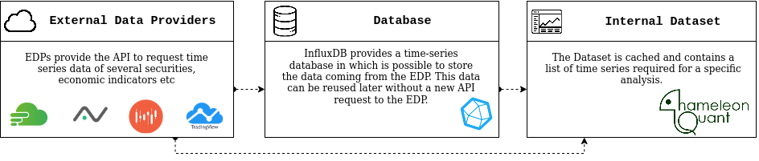

# chameleonQuant


 
<html>
<head>
  
</head>
<body>

<p align="center">
  
</p>

<h1>Mission</h1>
<p align="justify"> The framework is meant to help quants developing and testing innovative algorithmic trading strategies in the financial trading sector in a completely open-source environment. </p>

<h1>It's a jungle out there!</h1>
<div align="justify">
The financial market is a jungle. There are hidden gems waiting to be discovered but also ravenous beasts in the shadow waiting for your misstep. Experience, spirit of adaptation, and rock-solid hunting strategies are your true weapons to survive and thrive in the jungle. 
The chameleon is a master in this! It is a patient predator adapting to the surrounding environment and, when it's time to act, it is swift and deadly. Like a chameleon, you will need these skills to protect and grow your wealth in the financial market. Just like any young chameleon, you need to develop the best strategies that fit your expectations, learn from your mistakes, and keep evolving. 
The first steps are always the hardest. Do not give way to discouragement! There are probably zillions of things that are going through your mind right now, but keep reading, we will show you how chameleonQuant can help you to develop your own tool kit to live in the financial market jungle.
</div>

<h1> Prerequisites</h1>

<h1> Installing</h1>
Please note that this library is still in early development stages. Major API changes are expected in the near future.

<h1>First step into the jungle</h1>
<div align="justify">
No one would step into the jungle without a survival kit!  chameleonQuant helps you in this, providing you  a basic survival tool kit and a framework to support you in developing your own tools. A good understanding of the basic tools will help you to familiarize with the framework and its components, test a few preimplemented indicators,  strategies, etc, and unleash your creativity developing new ones. 
</div>
<h3>Your basic survival kit</h3>

<ul>
<li>Map</li>
<div align="justify">
An object that can not miss in a survival kit is a map. This is fundamental to navigate in the financial market. This map is not a classic map. If you use an old-school paper road map, this relies on a static environment. The financial market is poles apart. It is a very dynamic environment in which time plays a fundamental role. A static map would be useless because the financial market is in constant evolution. The financial market is composed by securities like a jungle is composed by plants. 
Just like the water and the sun are the main resources a plant needs to growth, in the classic model of an efficient security market, prices move in response to new public information that causes traders to simultaneously revise their belief ( <a href="https://papers.ssrn.com/sol3/papers.cfm?abstract_id=1298299">Why Do Security Prices Change? A Transaction-Level Analysis of Nyse Stocks</a> ).
A financial market map records the history of the securities and make them easily available to the user in the form of time series. Forecast the future evolution of the map is the ultimate goal of the user that can use its history as an input for predictive models.  

<p align="center">
 <figure align="center">
     
     <figcaption>
     <p align="center">Data Flow</p>
     </figcaption>
  </figure>
</p>

The user can access the map requiring to create a dataset. This latter contains a set of time series relevant for a specific analysis. The dataset can be built either directly requiring the data through the APIs of some data providers or through an intermediate database. The database proves particularly useful when the same data requests are repeated over time. Indeed, the external data providers usually charge the user based on the number of requests in a certain amount of time. Using the intermediate database requires a further step, namely, download the necessary data into the database before making them available to the dataset builder. 


```
List<String> stocksList = new ArrayList<>();

stocksList.add("AMZN");	 
stocksList.add("AAPL");
stocksList.add("FB");

UpdateFromAlphaVantageStocksEOD upf = new UpdateFromAlphaVantageStocksEOD(5, 500, 5);
upf.run(stocksList, "NASDAQ_EOD");

```
The code above is just an example of how to update the database with the end of day (EOD) data of Amazon, Apple, and Facebook using the external data provider AlphaVantage. For more information go to <a href="https://github.com/StefanoPenazzi/chameleonQuant/blob/master/src/main/java/data/README.md">Dataset Tutorial</a>

```
Controller.run();
		
SimpleDateFormat sdf = new SimpleDateFormat("yyyy-MM-dd HH:mm:ss");
Instant startInstant = (sdf.parse("2020-01-01 00:00:00")).toInstant();
Instant endInstant = null;

List<TimeSeriesRequestIdI> listQueries = new ArrayList<>();
listQueries.add(new TimeSeriesRequestIdInfluxdb.Builder(new TimeSeriesIdImpl.Builder("AMZN")
   .startInstant(startInstant)
   .endInstant(endInstant)
   .interval("1d")
   .build())
  .build());


 DatasetI dts = Controller.getDatasetFactory().create(listQueries);

```
Another example, in this case, a new query for the database is built and a new dataset containing the output of the query is created. For more information go to <a href="https://github.com/StefanoPenazzi/chameleonQuant/blob/master/src/main/java/data/README.md">Dataset Tutorial</a>

</div>
 
<li>Swiss Army knife</li>
<li>Training camp</li>
<div align="justify"> Do you want to be sure your skills and tools are ready to face the jungle? Let's put them to the test in the training camp! 
The training camp is a safe environment in which you are able to...
 </div>
</ul>

<h3>Expand the survival kit</h3>

<ul>
  <li>Expand the map</li>
  <li>Expand Swiss Army knife tools</li>
  <li>Training camp</li>
</ul>

<h3>Make some practice</h3>
<h3>Share with friends</h3>

<h1>Versioning and Packaging</h1>

<h1>References</h1>
</body>
</html>
